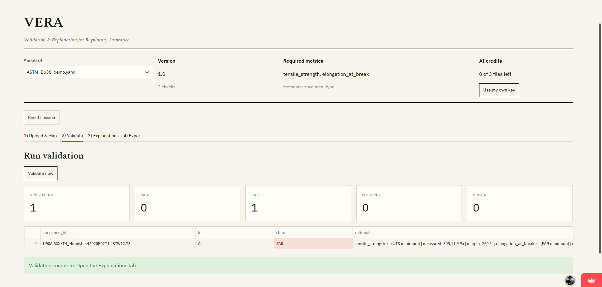

# VERA - Validation & Explanation for Regulatory Assurance

**[Try it live →](https://vera-compliance.streamlit.app/)**

> Hosted on Streamlit Community Cloud, which sleeps after inactivity. The first
> load may take a moment to wake, and if you see a loading error, refresh the
> page — it's a cached-asset issue on Streamlit's side, not the app.

VERA checks materials test results against a compliance standard and explains
what failed. Upload a lab CSV, confirm the column mapping, and get a
pass/fail verdict per specimen with the measured value, the threshold, and the
margin — plus a plain-English explanation and a one-page PDF report.

Standards are defined as YAML, so adding one takes a file rather than a code
change. You can also describe thresholds in plain English and have VERA compile
them into a template.



## Why it works this way

The verdicts are deterministic. Every pass, fail, missing value and unit error
comes from arithmetic in `src/rules.py`, not from a language model. That matters
in a compliance context: the result is reproducible, auditable, and identical on
every run.

The language model does three narrower jobs where judgement helps and errors are
recoverable:

- mapping messy lab headers (`UTS_MPa`, `σ_uts`, `Elong_pct`) to canonical metrics
- inferring units from header text and sample values
- writing the explanation of a failure, grounded only in the numbers already computed

If no model is available, VERA falls back to fuzzy header matching and template
default units. Validation still runs. Nothing silently depends on the model being
reachable.

## What it does

1. **Upload** a CSV or XLSX of test results
2. **Map** source columns to the standard's metrics, with AI suggestions you can override
3. **Validate** every specimen against the template's checks
4. **Explain** any specimen, enriched with remediation tips from a domain playbook
5. **Export** a formatted PDF report

Supported check types: `>=`, `<=`, `between`, and `in_set`. Unit conversion runs
through `pint`, so a template in MPa accepts source data in GPa or psi.

## Running it yourself

```bash
git clone https://github.com/puppalasaisrikar/VERA.git
cd VERA
python -m venv venv
pip install -r requirements.txt
```

Activate the environment — `venv\Scripts\activate` on Windows, `source venv/bin/activate` on macOS or Linux.

Set an Anthropic API key for the AI-assisted steps:

```bash
set ANTHROPIC_API_KEY=sk-ant-...   # macOS or Linux: export ANTHROPIC_API_KEY=sk-ant-...
streamlit run app.py
```

The key is optional. Without it VERA runs in deterministic-only mode. To disable
model calls explicitly, set `LLM_MODE=OFF`.

The hosted demo gives each visitor three free files on a shared key, then asks
for their own. Keys live in the browser session only and are never stored.

## Project layout

```
app.py                  Streamlit UI, four-step flow, free-tier quota
src/
  provider.py           the only place that talks to an LLM
  rules.py              deterministic check evaluation
  units.py              pint-backed unit conversion
  mapper.py             fuzzy and AI column mapping
  llm.py                grounded specimen explanations
  report.py             PDF generation
  io_utils.py           file loading
  theme.py              visual theme
templates/
  ASTM_D638_demo.yaml   example tensile standard
  ISO_527_demo.yaml     example tensile standard
  remediation_playbook.yaml
prepared_samples/
  nist_prepared.csv     synthetic demo data, including deliberately bad rows
```

## Defining a standard

```yaml
standard_id: ASTM-D638
version: "2023"
units:
  tensile_strength: MPa
  elongation_at_break: "%"
checks:
  - metric: tensile_strength
    op: ">="
    value: 55
    unit: MPa
    note: UTS minimum
  - metric: modulus
    op: between
    min: 1.5
    max: 3.5
    unit: GPa
```

## Known limits

- VERA treats a physically impossible reading (a negative elongation, say) as a
  FAIL rather than flagging it as corrupt data. Distinguishing the two is the
  next thing worth building.
- The free-tier counter keys off IP address. It resets when the hosted app
  restarts, and visitors behind a shared network share one allowance.
- Explanations are generated. They are constrained to the computed numbers, but
  they are not a substitute for a qualified reviewer signing off.

## Built with

Python · Streamlit · pandas · pint · reportlab · rapidfuzz · Claude API

## License

See [LICENSE](LICENSE).
